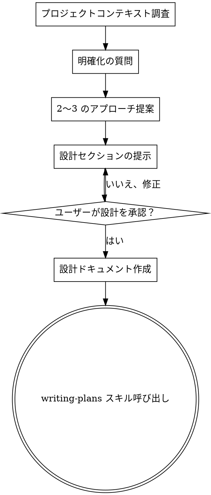

# アイデアを設計に昇華する

## 概要

自然な対話を通じて、アイデアを完全な設計・仕様に仕上げる。

まずプロジェクトの現状を把握し、一度に一つずつ質問してアイデアを洗練させる。何を作るか理解できたら設計を提示し、ユーザーの承認を得る。

<HARD-GATE>
設計を提示しユーザーが承認するまで、実装スキルの呼び出し、コードの記述、プロジェクトのスキャフォールド、その他一切の実装作業を行ってはならない。プロジェクトの規模に関係なく、すべてのケースに適用する。
</HARD-GATE>

## アンチパターン: 「これは単純すぎて設計は不要」

すべてのプロジェクトでこのプロセスを踏む。TODO リスト、単一関数のユーティリティ、設定変更 — すべて対象。「単純な」プロジェクトこそ、検証されていない前提が最も多くの手戻りを引き起こす。設計は短くてよい（本当に単純なら数行で十分）が、必ず提示して承認を得ること。

## チェックリスト

以下の各項目に対してタスクを作成し、順番に完了すること：

1. **プロジェクトのコンテキストを調査** — ファイル、ドキュメント、最近のコミットを確認
2. **明確化のための質問** — 一度に一つずつ、目的・制約・成功基準を理解
3. **2〜3 のアプローチを提案** — トレードオフと推奨案を提示
4. **設計を提示** — 複雑さに応じたセクションに分け、各セクションごとにユーザー承認を得る
5. **設計ドキュメントの作成** — `docs/plans/YYYY-MM-DD-<topic>-design.md` に保存しコミット
6. **実装への移行** — writing-plans スキルを呼び出して実装計画を作成

## プロセスフロー

**最終状態は writing-plans の呼び出し。** frontend-design、mcp-builder、その他の実装スキルは呼び出さないこと。brainstorming の後に呼び出すスキルは writing-plans のみ。

## プロセス

**アイデアの理解:**
- まずプロジェクトの現状を確認する（ファイル、ドキュメント、最近のコミット）
- 一度に一つずつ質問してアイデアを洗練させる
- 可能な限り選択式の質問を優先するが、自由記述でも問題ない
- 1 メッセージにつき 1 つの質問 — 深掘りが必要なら複数のメッセージに分ける
- 目的、制約、成功基準の理解に集中する

**アプローチの検討:**
- トレードオフを含む 2〜3 の異なるアプローチを提案する
- 推奨案と理由を添えて、対話的にオプションを提示する
- 推奨案を先に示し、その理由を説明する

**設計の提示:**
- 何を作るか理解できたと判断したら、設計を提示する
- 各セクションを複雑さに応じてスケーリング: 単純なら数行、複雑なら 200〜300 語程度
- 各セクションの後に「ここまで問題ないか」確認する
- カバーすべき項目: アーキテクチャ、コンポーネント、データフロー、エラーハンドリング、テスト
- 不明点があれば前に戻って確認する

## 設計の後

**ドキュメント:**
- 検証済みの設計を `docs/plans/YYYY-MM-DD-<topic>-design.md` に書き出す
- elements-of-style:writing-clearly-and-concisely スキルが利用可能なら使用する
- 設計ドキュメントを git にコミットする

**実装:**
- writing-plans スキルを呼び出して詳細な実装計画を作成する
- 他のスキルは呼び出さない。次のステップは writing-plans のみ。

## 基本原則

- **一度に一つの質問** - 複数の質問で圧倒しない
- **選択式を優先** - 可能な限り自由記述より選択式で答えやすく
- **YAGNI を徹底** - 不要な機能をすべての設計から排除する
- **代替案を検討** - 決定前に必ず 2〜3 のアプローチを提案する
- **段階的な検証** - 設計を提示し、次に進む前に承認を得る
- **柔軟に対応** - 不明点があれば前に戻って確認する
