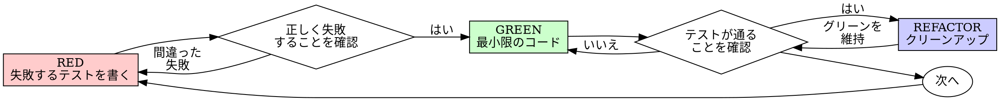

# テスト駆動開発（TDD）

## 概要

まずテストを書く。失敗を確認する。テストを通す最小限のコードを書く。

**基本原則:** テストが失敗するのを見ていなければ、正しいものをテストしているか分からない。

**ルールの文言に違反することは、ルールの精神に違反することと同じ。**

## いつ使うか

**常に使う:**
- 新機能
- バグ修正
- リファクタリング
- 動作変更

**例外（人間のパートナーに相談）:**
- 使い捨てのプロトタイプ
- 自動生成コード
- 設定ファイル

「今回だけ TDD をスキップしよう」と思ったら？ やめること。それは自己正当化。

## 鉄の掟

```
失敗するテストなしにプロダクションコードを書いてはならない
```

テストの前にコードを書いた？ 削除して最初からやり直す。

**例外なし:**
- 「参考として」残さない
- テストを書きながら「適応」させない
- 見もしない
- 削除は削除

テストからフレッシュに実装する。以上。

## Red-Green-Refactor



### RED - 失敗するテストを書く

何が起こるべきかを示す最小限のテストを一つ書く。

<Good>
```typescript
test('失敗した操作を3回リトライする', async () => {
  let attempts = 0;
  const operation = () => {
    attempts++;
    if (attempts < 3) throw new Error('fail');
    return 'success';
  };

  const result = await retryOperation(operation);

  expect(result).toBe('success');
  expect(attempts).toBe(3);
});
```
明確な名前、実際の動作をテスト、一つのこと
</Good>

<Bad>
```typescript
test('リトライが動く', async () => {
  const mock = jest.fn()
    .mockRejectedValueOnce(new Error())
    .mockRejectedValueOnce(new Error())
    .mockResolvedValueOnce('success');
  await retryOperation(mock);
  expect(mock).toHaveBeenCalledTimes(3);
});
```
曖昧な名前、コードではなくモックをテストしている
</Bad>

**要件:**
- 一つの動作
- 明確な名前
- 本物のコード（避けられない場合以外モック不使用）

### RED の確認 - 失敗を見届ける

**必須。絶対にスキップしない。**

```bash
npm test path/to/test.test.ts
```

確認事項:
- テストが失敗する（エラーではなく失敗）
- 失敗メッセージが想定通り
- 機能が未実装のため失敗している（タイポではない）

**テストが通った？** 既存の動作をテストしている。テストを修正。

**テストがエラーになった？** エラーを修正し、正しく失敗するまで再実行。

### GREEN - 最小限のコード

テストを通す最もシンプルなコードを書く。

<Good>
```typescript
async function retryOperation<T>(fn: () => Promise<T>): Promise<T> {
  for (let i = 0; i < 3; i++) {
    try {
      return await fn();
    } catch (e) {
      if (i === 2) throw e;
    }
  }
  throw new Error('unreachable');
}
```
テストを通すのに十分なだけ
</Good>

<Bad>
```typescript
async function retryOperation<T>(
  fn: () => Promise<T>,
  options?: {
    maxRetries?: number;
    backoff?: 'linear' | 'exponential';
    onRetry?: (attempt: number) => void;
  }
): Promise<T> {
  // YAGNI（今必要ない）
}
```
過剰設計
</Bad>

テストの範囲を超えて機能を追加したり、他のコードをリファクタリングしたり、「改善」したりしない。

### GREEN の確認 - テストの成功を見届ける

**必須。**

```bash
npm test path/to/test.test.ts
```

確認事項:
- テストが通る
- 他のテストも引き続き通る
- 出力がクリーン（エラー、警告なし）

**テストが失敗した？** コードを修正。テストを修正するのではない。

**他のテストが失敗した？** 今すぐ修正。

### REFACTOR - クリーンアップ

グリーンになった後のみ:
- 重複を除去
- 名前を改善
- ヘルパーを抽出

テストをグリーンに保つ。動作を追加しない。

### 繰り返す

次の機能のために次の失敗するテストへ。

## 良いテスト

| 品質 | 良い例 | 悪い例 |
|------|--------|--------|
| **最小限** | 一つのこと。名前に「and」があるなら分割する | `test('メールとドメインと空白を検証する')` |
| **明確** | 名前が動作を説明する | `test('test1')` |
| **意図を示す** | 望ましい API を示す | コードが何をすべきかを隠す |

## 順序が重要な理由

**「後でテストを書いて検証する」**

実装後に書かれたテストはすぐに通る。すぐに通ることは何も証明しない:
- 間違ったものをテストしているかもしれない
- 動作ではなく実装をテストしているかもしれない
- 忘れたエッジケースを見逃しているかもしれない
- テストがバグを検出するのを見ていない

テストファーストはテストが失敗するのを見ることを強制し、実際に何かをテストしていることを証明する。

**「すべてのエッジケースを手動テスト済み」**

手動テストはアドホック。すべてテストしたと思っているが:
- テスト内容の記録がない
- コード変更時に再実行できない
- プレッシャー下ではケースを忘れやすい
- 「やってみたら動いた」≠ 網羅的テスト

自動テストは体系的。毎回同じように実行される。

**「X 時間の作業を削除するのは無駄」**

サンクコストの誤謬。時間は既に失われている。今の選択:
- 削除して TDD で書き直す（X 時間追加、高い信頼性）
- 残して後からテスト追加（30 分、低い信頼性、バグの可能性大）

「無駄」なのは信頼できないコードを残すこと。本物のテストなしの動作するコードは技術的負債。

**「TDD は教条的、実用的とは状況に応じて適応すること」**

TDD こそ実用的:
- コミット前にバグを発見（デバッグより速い）
- リグレッション防止（テストが即座に破壊を検出）
- 動作の文書化（テストがコードの使い方を示す）
- リファクタリングを可能にする（自由に変更、テストが破壊を検出）

「実用的」なショートカット = 本番でのデバッグ = 結局遅い。

**「後からテストでも同じ目的を達成できる — 形式より精神」**

違う。後からテストは「このコードは何をするか？」に答える。テストファーストは「このコードは何をすべきか？」に答える。

後からテストは実装に偏る。作ったものをテストし、要求されたものをテストしない。記憶したエッジケースを検証し、発見されたエッジケースを検証しない。

テストファーストは実装前にエッジケースの発見を強制する。後からテストはすべてを記憶していたかを検証する（していない）。

30 分の後追いテスト ≠ TDD。カバレッジは得られるが、テストが機能する証明を失う。

## よくある自己正当化

| 言い訳 | 現実 |
|--------|------|
| 「テストするほど複雑じゃない」 | 単純なコードも壊れる。テストは 30 秒。 |
| 「後でテストする」 | すぐに通るテストは何も証明しない。 |
| 「後からテストでも同じ」 | 後から = 「何をするか？」。先に = 「何をすべきか？」 |
| 「手動テスト済み」 | アドホック ≠ 体系的。記録なし、再実行不可。 |
| 「X 時間を削除するのは無駄」 | サンクコストの誤謬。未検証コードを残すのが技術的負債。 |
| 「参考として残してテストを先に書く」 | 適応してしまう。それは後追いテスト。削除は削除。 |
| 「まず探索が必要」 | 問題ない。探索は捨てて TDD で始める。 |
| 「テストが難しい = 設計が不明確」 | テストの声を聴く。テストしにくい = 使いにくい。 |
| 「TDD は遅くなる」 | TDD はデバッグより速い。実用的 = テストファースト。 |
| 「手動テストの方が速い」 | 手動ではエッジケースを証明できない。変更ごとに再テスト。 |
| 「既存コードにテストがない」 | 改善している最中。既存コードにもテストを追加する。 |

## 危険信号 - 止まってやり直す

- テスト前にコードを書いた
- 実装後にテストを書いた
- テストがすぐに通った
- テストがなぜ失敗したか説明できない
- テストを「後で」追加した
- 「今回だけ」と自己正当化している
- 「手動テスト済み」
- 「後からテストでも同じ目的」
- 「形式より精神」
- 「参考として残す」「既存コードを適応」
- 「X 時間かけたのに削除は無駄」
- 「TDD は教条的、実用的に」
- 「今回は違う、なぜなら…」

**以上すべてが意味すること: コードを削除し、TDD でやり直す。**

## 例: バグ修正

**バグ:** 空のメールが受け入れられる

**RED**
```typescript
test('空のメールを拒否する', async () => {
  const result = await submitForm({ email: '' });
  expect(result.error).toBe('Email required');
});
```

**RED の確認**
```bash
$ npm test
FAIL: expected 'Email required', got undefined
```

**GREEN**
```typescript
function submitForm(data: FormData) {
  if (!data.email?.trim()) {
    return { error: 'Email required' };
  }
  // ...
}
```

**GREEN の確認**
```bash
$ npm test
PASS
```

**REFACTOR**
必要に応じて複数フィールドのバリデーションを抽出。

## 検証チェックリスト

作業完了を宣言する前に:

- [ ] すべての新しい関数/メソッドにテストがある
- [ ] 各テストが実装前に失敗するのを確認した
- [ ] 各テストが想定通りの理由で失敗した（機能未実装であり、タイポではない）
- [ ] 各テストを通す最小限のコードを書いた
- [ ] すべてのテストが通る
- [ ] 出力がクリーン（エラー、警告なし）
- [ ] テストが本物のコードを使用している（避けられない場合以外モック不使用）
- [ ] エッジケースとエラーケースをカバー済み

すべてにチェックできない？ TDD をスキップした。やり直す。

## 行き詰まった時

| 問題 | 解決策 |
|------|--------|
| テスト方法が分からない | 望ましい API を書く。アサーションから書く。人間のパートナーに相談。 |
| テストが複雑すぎる | 設計が複雑すぎる。インターフェースを簡素化。 |
| すべてをモックする必要がある | コードの結合度が高すぎる。依存性注入を使用。 |
| テストのセットアップが巨大 | ヘルパーを抽出。それでも複雑？ 設計を簡素化。 |

## デバッグとの統合

バグを発見したら？ それを再現する失敗するテストを書く。TDD サイクルに従う。テストが修正を証明し、リグレッションを防止する。

テストなしにバグを修正しない。

## テストのアンチパターン

モックやテストユーティリティを追加する際は @testing-anti-patterns.md を読み、よくある落とし穴を避ける:
- 実際の動作ではなくモックの動作をテストしている
- プロダクションクラスにテスト専用メソッドを追加している
- 依存関係を理解せずにモックしている

## 最終ルール

```
プロダクションコード → テストが存在し、先に失敗した
それ以外 → TDD ではない
```

人間のパートナーの許可なしに例外なし。
