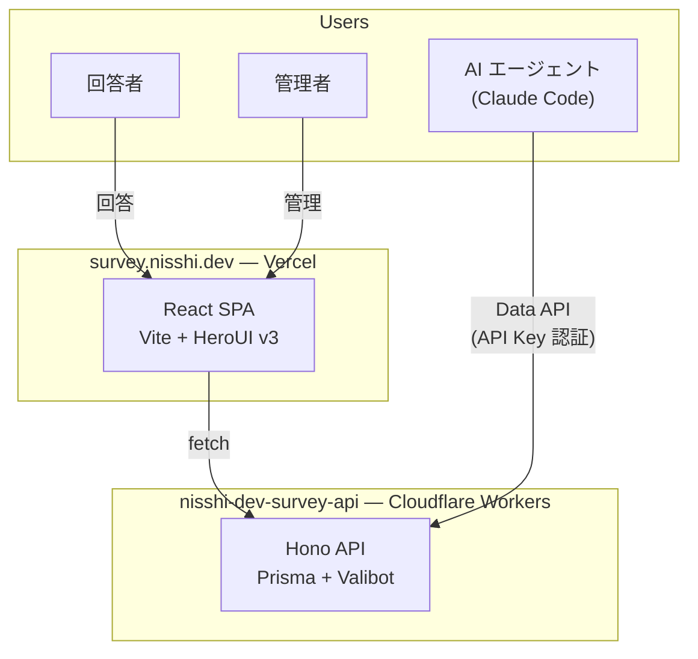
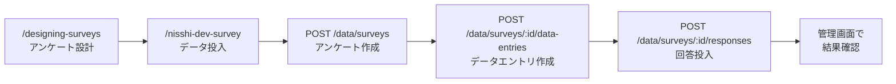

# nisshi-dev Survey API

[](https://dash.cloudflare.com/?to=/:account/workers/services/view/nisshi-dev-survey-api)
[](https://hono.dev)
[](https://www.prisma.io)
[](https://www.typescriptlang.org)
[](https://vitest.dev)

[nisshi-dev Survey](https://github.com/nisshi-dev/nisshi-dev-survey) のバックエンド API サーバー。アンケート作成・回答収集・データ投入を提供する。

| | URL |
|---|---|
| Production | https://nisshi-dev-survey-api.nisshi.workers.dev |
| Swagger UI | https://nisshi-dev-survey-api.nisshi.workers.dev/ui |
| Cloudflare Dashboard | [Workers > nisshi-dev-survey-api](https://dash.cloudflare.com/45e74bc4f7c04a2b396544c4b7c72812/workers/services/view/nisshi-dev-survey-api/production) |

## アーキテクチャ



| | フロントエンド | API（本リポ） |
|---|---|---|
| リポジトリ | [`nisshi-dev-survey`](https://github.com/nisshi-dev/nisshi-dev-survey) | `nisshi-dev-survey-api` |
| デプロイ先 | Vercel | Cloudflare Workers |
| Framework | Vite（SPA） | Hono |

## 技術スタック

| レイヤー | 技術 |
|---|---|
| API | [Hono](https://hono.dev) |
| DB | [Prisma](https://www.prisma.io) ORM 7 + PostgreSQL（`@prisma/adapter-pg`） |
| 認証 | [better-auth](https://www.better-auth.com)（Google OAuth + セッション管理） |
| バリデーション | [Valibot](https://valibot.dev) |
| API ドキュメント | hono-openapi + Swagger UI |
| メール送信 | [Resend](https://resend.com) |
| テスト | [Vitest](https://vitest.dev) 4.x |
| デプロイ | [Cloudflare Workers](https://workers.cloudflare.com) |
| リント・フォーマット | [Ultracite](https://github.com/haydenbleasel/ultracite)（Biome） |

## API エンドポイント

エンドポイントの詳細は [Swagger UI](https://nisshi-dev-survey-api.nisshi.workers.dev/ui) を参照。

| カテゴリ | パスプレフィックス | 認証 |
|---|---|---|
| 回答者向け | `/survey` | 不要 |
| 管理者向け | `/admin/auth`, `/admin/surveys` | better-auth セッション（Google OAuth） |
| データ投入 API | `/data/surveys` | `X-API-Key` ヘッダー |
| ユーティリティ | `/health`, `/doc`, `/ui` | 不要 |

## AI エージェント連携

Claude Code のスキルを使い、対話的にアンケートの設計からデータ投入までを自動化できる。



## Claude Code Skills

| スキル | 説明 |
|---|---|
| `/nisshi-dev-survey` | Data API でアンケート作成・データエントリ作成・回答投入を自動化 |
| `/designing-surveys` | アンケート設計のベストプラクティスに基づく設計支援 |
| `/test-driven-development` | TDD の Red-Green-Refactor サイクルに従った開発 |
| `/vitest` | Vitest のテスト作成・モック・カバレッジ設定 |
| `/hono` | Hono アプリケーション開発のドキュメント参照 |
| `/prisma-expert` | Prisma スキーマ設計・マイグレーション・クエリ最適化 |
| `/better-auth-best-practices` | better-auth の統合・セッション管理・セキュリティ |
| `/email-best-practices` | メール送信・迷惑メール対策・法令遵守 |
| `/brainstorming` | 機能実装前の要件・設計の深掘り |
| `/cloudflare` | Cloudflare Workers / KV / D1 / R2 の開発 |

## セットアップ

### 前提条件

- Node.js 24.x
- npm 11.x

### インストール

```bash
npm install
cp .dev.vars.example .dev.vars  # 環境変数を設定
npm run db:migrate              # マイグレーション適用
npm run db:seed                 # 許可メールアドレス登録
```

### 環境変数

| 変数 | 説明 | 設定先 |
|---|---|---|
| `DATABASE_URL` | PostgreSQL 接続 URL | secret |
| `RESEND_API_KEY` | Resend API キー | secret |
| `NISSHI_DEV_SURVEY_API_KEY` | データ投入 API の認証キー | secret |
| `GOOGLE_CLIENT_ID` | Google OAuth クライアント ID | secret |
| `GOOGLE_CLIENT_SECRET` | Google OAuth クライアントシークレット | secret |
| `BETTER_AUTH_SECRET` | better-auth 暗号化シークレット（32 文字以上） | secret |
| `ALLOWED_ORIGINS` | CORS 許可オリジン（カンマ区切り、`*` ワイルドカード対応） | `wrangler.jsonc` vars |
| `RESEND_FROM_EMAIL` | メール送信元アドレス | `wrangler.jsonc` vars |
| `BETTER_AUTH_URL` | better-auth ベース URL | `wrangler.jsonc` vars |
| `ADMIN_EMAIL` | 許可メールアドレス（seed 用） | `.dev.vars` |

## 開発

### 主要コマンド

| コマンド | 説明 |
|---|---|
| `npm run dev` | 開発サーバー起動（`wrangler dev`） |
| `npm test` | Vitest ウォッチモード |
| `npm run test:run` | テスト 1 回実行（TDD で開発） |
| `npm run check` | リント・フォーマット検査 |
| `npm run fix` | 自動修正 |
| `npm run db:migrate` | マイグレーション作成・適用 |
| `npm run db:studio` | Prisma Studio 起動 |
| `npm run generate:openapi` | OpenAPI JSON 出力（要: `npm run dev` 起動中） |

## デプロイ

```bash
# シークレット設定（初回のみ）
wrangler secret put DATABASE_URL
wrangler secret put RESEND_API_KEY
wrangler secret put NISSHI_DEV_SURVEY_API_KEY
wrangler secret put GOOGLE_CLIENT_ID
wrangler secret put GOOGLE_CLIENT_SECRET
wrangler secret put BETTER_AUTH_SECRET

# デプロイ
npm run deploy
```

`ALLOWED_ORIGINS`, `RESEND_FROM_EMAIL`, `BETTER_AUTH_URL` は `wrangler.jsonc` の `vars` で管理。

## ドキュメント

詳細は [CLAUDE.md](CLAUDE.md) および [docs/](docs/) を参照。

| ドキュメント | 内容 |
|---|---|
| [docs/overview.md](docs/overview.md) | 要件定義・仕様 |
| [docs/architecture.md](docs/architecture.md) | アーキテクチャ・技術仕様 |
| [docs/coding-rules.md](docs/coding-rules.md) | コーディングルール |
| [docs/validation.md](docs/validation.md) | バリデーション方針（Valibot） |
| [docs/git-guidelines.md](docs/git-guidelines.md) | Git ガイドライン |

## License

[MIT](LICENSE)
